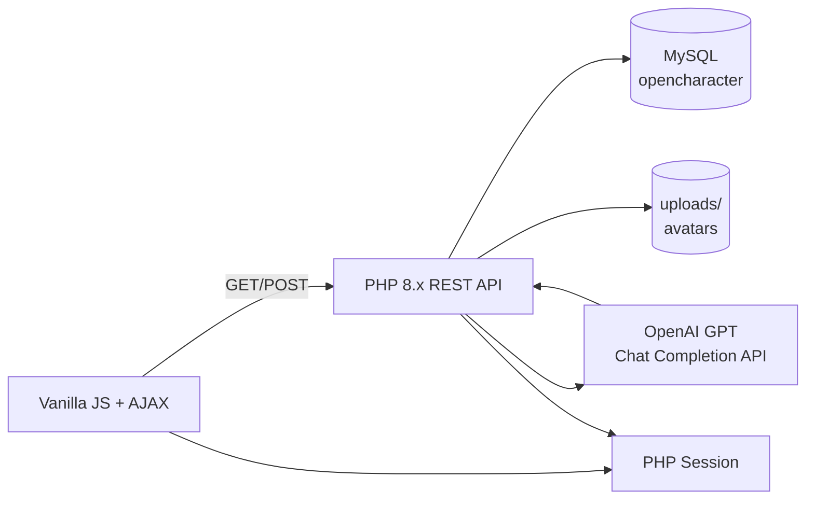

# 🤖 OpenCharacter

> Đồ án môn **Lập trình Website** — Web App cho phép tạo nhân vật ảo với mô tả riêng, **phân loại thể loại tự động bằng GPT**, lưu lịch sử chat và trò chuyện theo thời gian thực như ChatGPT.

[](https://www.php.net)
[](https://www.mysql.com)
[](https://openai.com)
[](#-tech-stack)
[](LICENSE)
[](#-tác-giả)

---

## 📸 Demo

> Screenshots sẽ được thêm sau.

---

## ✨ Tính năng chính

- 🔐 **Đăng ký / Đăng nhập / Quên mật khẩu** (PHP Session)
- 🎭 **Tạo nhân vật ảo** với avatar, mô tả, giới thiệu, lời chào
- 🤖 **Phân loại thể loại nhân vật tự động** qua OpenAI GPT API
- 💬 **Trò chuyện real-time** với nhân vật (vanilla JS + AJAX)
- 📚 **Lịch sử chat** có lọc theo nhân vật
- 🏆 **Bảng xếp hạng** các nhân vật phổ biến
- 👤 **Quản lý hồ sơ** (tên, avatar)
- 📱 **Responsive UI** — dùng tốt trên desktop & mobile
- 🖼️ **Upload avatar** dạng base64 hoặc file

---

## 🏗️ Kiến trúc



**Luồng chính**:
1. User đăng nhập → PHP Session lưu `user_id`.
2. Tạo nhân vật → POST `/api/characters/` → GPT phân loại → lưu MySQL.
3. Chat → POST `/api/chats/` → GPT trả lời → lưu lịch sử.
4. Leaderboard → GET `/api/leaderboard/` → sort theo `usage_count`.

---

## 🧰 Tech Stack

| Layer | Technology |
|---|---|
| **Frontend** | HTML5, CSS3, Vanilla JavaScript, AJAX (Fetch API) |
| **Backend** | PHP 8.x — REST API (mỗi resource 1 file PHP) |
| **Database** | MySQL 8 với `utf8mb4` |
| **AI** | OpenAI GPT (Chat Completion API) |
| **Auth** | PHP Session + password_hash |
| **Storage** | Local filesystem (`uploads/`) cho avatar |

---

## 📂 Cấu trúc dự án

```text
character-ai-team4/
├── src/                       # Frontend (HTML/CSS/JS)
│   ├── index.html             # Trang chính
│   ├── createcharacter.html   # Tạo nhân vật
│   ├── chat.html              # Giao diện chat
│   ├── chatlist.html          # Lịch sử chat
│   ├── leaderboard.html       # Bảng xếp hạng
│   ├── profile.html           # Hồ sơ người dùng
│   ├── login.html / register.html / forgot.html / reset.html
│   ├── assets/                # logo, icons, avatars mặc định
│   └── css/                   # style chính
│
├── api/                       # Backend REST API (PHP)
│   ├── config.php             # ⚠️ DB + OpenAI key (xem .gitignore)
│   ├── auth.php               # /api/auth/*
│   ├── characters.php         # /api/characters/*
│   ├── chats.php              # /api/chats/*
│   ├── leaderboard.php        # /api/leaderboard/*
│   ├── users.php              # /api/users/*
│   ├── avatar.php             # /api/avatar/*
│   ├── gpt_helper.php         # Helper gọi OpenAI
│   └── utils.php              # Helper chung
│
├── uploads/                   # Avatar user (đã gitignore)
├── docs/
│   └── screenshots/           # Screenshot cho README
│
├── README.md
├── LICENSE                    # MIT
├── CHANGELOG.md
├── CONTRIBUTING.md
├── CODE_OF_CONDUCT.md
├── SECURITY.md
└── package.json               # dùng cho live-server
```

---

## 🚀 Cài đặt nhanh (Localhost)

### Yêu cầu

- **XAMPP / WAMP / MAMP** (PHP 8.x + MySQL 8) — [tải XAMPP](https://www.apachefriends.org/)
- **OpenAI API key** — [lấy tại đây](https://platform.openai.com/api-keys)
- Trình duyệt hiện đại (Chrome / Edge / Firefox)

### Các bước

1. **Clone** repo vào thư mục `htdocs/` (hoặc tương đương):
   ```bash
   cd C:\xampp\htdocs
   git clone https://github.com/NiTz130/character-ai-team4.git
   cd character-ai-team4
   ```

2. **Tạo database** trong phpMyAdmin:
   ```sql
   CREATE DATABASE opencharacter CHARACTER SET utf8mb4 COLLATE utf8mb4_unicode_ci;
   ```
   Import schema (nếu có file `.sql` trong repo) hoặc tạo bảng thủ công theo tài liệu API.

3. **Cấu hình** `api/config.php`:
   ```php
   $db_host = "localhost";
   $db_user = "root";
   $db_pass = "";                  // mật khẩu MySQL của bạn
   $db_name = "opencharacter";
   $openai_api_key = "sk-...";     // OpenAI API key
   ```

4. **Khởi động** Apache + MySQL trong XAMPP, mở trình duyệt:
   ```
   http://localhost/character-ai-team4/src/
   ```

5. **Đăng ký tài khoản** mới và bắt đầu tạo nhân vật + chat!

---

## 🔌 API Endpoints (tóm tắt)

Xem comment trong từng file `api/*.php` để biết chi tiết request/response.

| Method | Endpoint | Mô tả |
|---|---|---|
| `POST` | `/api/auth/register` | Đăng ký tài khoản |
| `POST` | `/api/auth/login` | Đăng nhập |
| `POST` | `/api/auth/forgot` | Yêu cầu reset mật khẩu |
| `POST` | `/api/auth/reset` | Reset mật khẩu |
| `GET` | `/api/characters` | Danh sách nhân vật |
| `POST` | `/api/characters` | Tạo nhân vật mới (GPT phân loại) |
| `GET` | `/api/characters/{id}` | Chi tiết nhân vật |
| `POST` | `/api/chats` | Gửi tin nhắn cho nhân vật |
| `GET` | `/api/chats?character_id=` | Lịch sử chat |
| `GET` | `/api/leaderboard` | Bảng xếp hạng |
| `POST` | `/api/avatar` | Upload avatar |
| `GET` `/POST` | `/api/users` | Hồ sơ người dùng |

---

## 🐛 Troubleshooting

| Lỗi | Nguyên nhân | Cách xử lý |
|---|---|---|
| Trang trắng | PHP chưa bật | Bật Apache trong XAMPP |
| Lỗi kết nối DB | Sai `db_user` / `db_pass` | Kiểm tra `api/config.php` |
| GPT không phản hồi | Sai / hết hạn API key | Thay key mới, kiểm tra billing |
| Upload avatar fail | `uploads/` không có quyền ghi | `chmod 755 uploads/` (Linux/Mac) |
| Font tiếng Việt lỗi | DB không dùng `utf8mb4` | Set `utf8mb4` cho DB + connection |

---

## 🛠️ Phát triển

### Live reload (tùy chọn)

Nếu muốn dùng `live-server` để auto-refresh frontend:

```bash
npm install -g live-server
cd src
live-server
```

(Repo có sẵn `package.json` với script `npm start` chạy `live-server src`.)

### Quy ước code

- **PHP**: PSR-12, dùng `require_once` thay vì `include`.
- **JS**: ES6+, `fetch` API, không dùng jQuery.
- **SQL**: Prepared statements cho mọi query có user input.
- **Security**: `password_hash` / `password_verify`, escape output qua `htmlspecialchars`.

---

## 🤝 Đóng góp

Xem [CONTRIBUTING.md](CONTRIBUTING.md). PRs welcome.

## 🔒 Bảo mật

Xem [SECURITY.md](SECURITY.md). **Không commit** OpenAI API key thật vào repo — dùng biến môi trường hoặc file ngoài `.gitignore`.

## 📝 Changelog

Xem [CHANGELOG.md](CHANGELOG.md).

## 📄 License

MIT — xem [LICENSE](LICENSE).

---

## 👥 Tác giả

| Vai trò | Tên | GitHub |
|---|---|---|
| Thành viên | **Nguyễn Lê Đức Bình** | [@NiTz130](https://github.com/NiTz130) |
| Thành viên | **Đinh Hoàng Phú** | [@phudh](https://github.com/phudh) |

- **Lớp:** 26TH01
- **Giáo viên hướng dẫn:** ThS. Trần Thịnh Mạnh Đức
- **Môn học:** Lập trình Website (Web Programming)
- **Năm học:** 2024–2025
